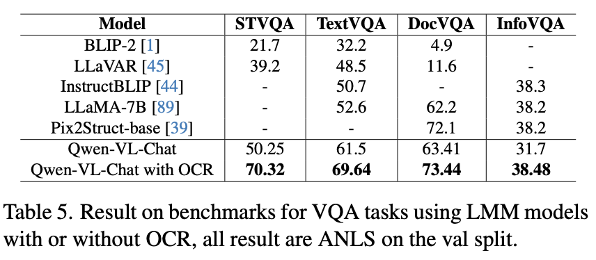
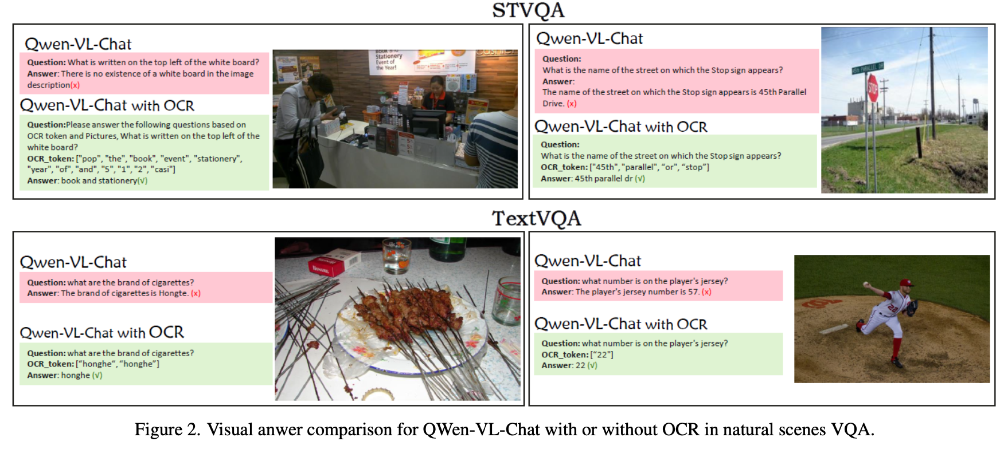
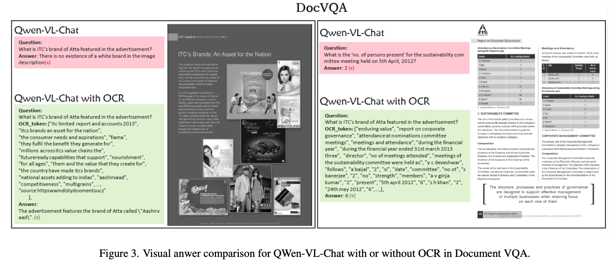
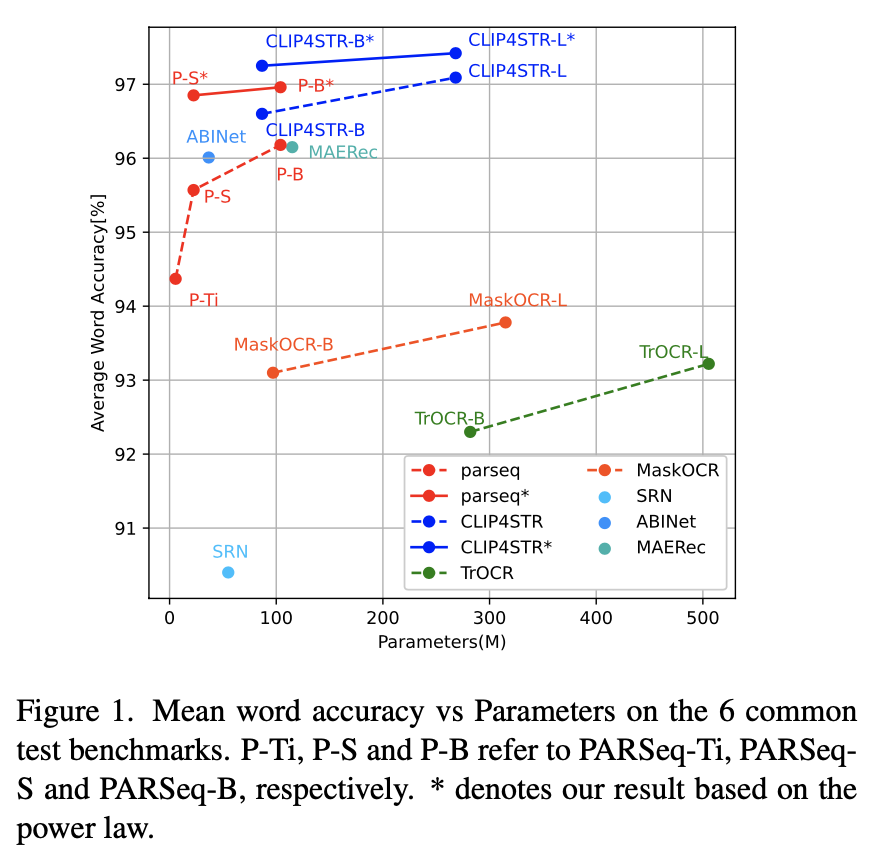
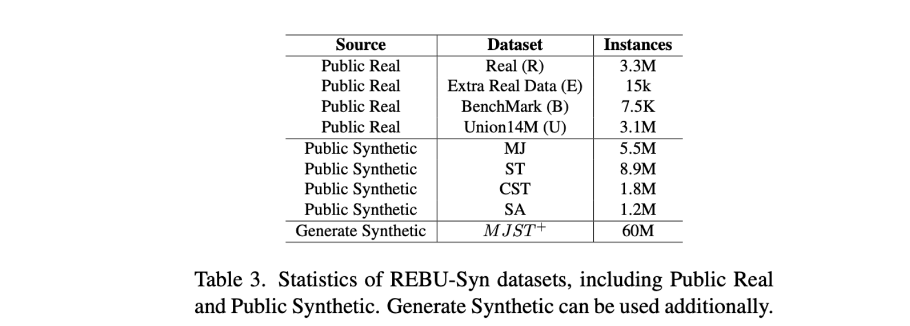
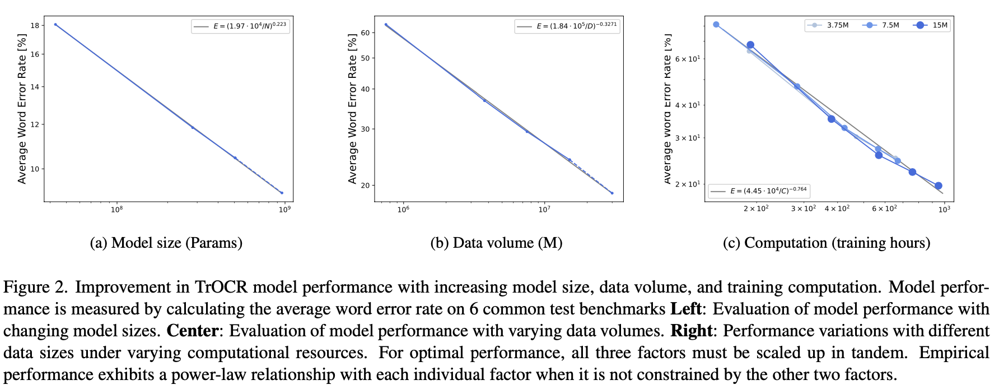

#  An Empirical Study of Scaling Law for OCR

Recently, multimodal large models have received widespread attention in academia and industry, and their visual language interaction capabilities have been outstanding. However, in the field of optical character recognition (OCR), that is, the ability to extract textual information from images, the performance of multi-modal large models is relatively weak. With the continuous advancement of technology, this problem has been significantly improved with the advanced performance of large OCR models. OCR large models perform better in terms of recognition accuracy and robustness. Today, OCR large models have become an important tool for multi-modal large models in the OCR field, providing strong support for the development of related applications. We present the OCR model to Qwen-VL-Chat within the framework of the expanding research on multi-modal large models (LMM) and carry out an extensive evaluation on four VQA tasks. The findings demonstrate the effectiveness of OCR in processing challenging visual-language interaction tasks, the significance of OCR in enhancing multi-modal large model text recognition capabilities, and the significant improvement in LMM accuracy on VQA tasks.

## 📸 VQA visualization effects

- In the visual analysis of STVQA and TextVQA tasks, we found that the Qwen-VL_Chat large model has certain challenges in capturing small text or correctly identifying text content. However, when OCR technology is introduced, large models can more accurately understand the text content in images, such as identifying small texts more effectively in the STVQA task. Correctly correct "Hongte" to "Honghe" and "57" to "22" in the TextVQA task.

  

- In the DocVQA task, when the model handles common document scenarios with rich text information, we find that large models perform poorly in identifying and processing large amounts of text information. For example, when asked about the advertising logo in the image, the model may not accurately find the target or be given a word that does not exist. After the introduction of OCR, the model can more accurately identify text in images, improving the accuracy when processing rich text information.

  

## 🦙 Construction of large OCR model

In the field of natural language processing (NLP), the relationship between model size, data volume, computing power and model performance has been extensively studied. However, in the field of optical character recognition (OCR), the exploration of these "scaling laws" is still in its infancy. To fill this gap, we conducted a comprehensive study and in-depth analysis of the relationship between model size, data volume, and computing power and OCR performance. The results reveal that, holding other influencing factors constant, there is a smooth exponential relationship between performance and model size and training data volume. In addition, we also create a large-scale dataset REBU-Syn, containing 6 million real samples and 18 million synthetic samples. Using these rules and data sets, we successfully trained a high-precision OCR model and achieved SOTA accuracy on the OCR test benchmark. **In particular, we found that the OCR model can significantly enhance the capabilities of multi-modal large models and achieve significant accuracy improvements on multiple VQA tasks, proving the great potential of OCR in improving the performance of multi-modal large models.**

## 🛠️ Dataset

In the field of OCR, the quality and diversity of data sets are extremely important. We created a new data set REBU-Syn by collecting and integrating open source data sets. In addition, we utilize the latest generation technology to generate 60M synthetic data MJST+ for additional use.

You should follow the instructions in [Data.md](https://github.com/large-ocr-model/large-ocr-model.github.io/blob/main/Data.md) to manage your dataset.

## 🗝️ Scaling Law for OCR

#### Core conclusion: The scaling law holds in the field of OCR. There exist smooth power laws between the size of the model, the volume of data, computation and performance.

By exploring the impact of the parameter amount, calculation amount, and data amount of small and medium-sized models on accuracy in multiple OCR methods, we successfully proved that the Power-Law law exists in these three dimensions in the OCR field. This discovery provides an important theoretical basis for OCR model design.

You should follow the instructions in [Inference.md](https://github.com/large-ocr-model/large-ocr-model.github.io/blob/main/Inference.md) to get the model and infer the accuracy mentioned in the paper.

## Conclusion

These research results show that OCR technology plays a key role in improving the performance of multi-modal large models, especially when processing complex visual question and answer tasks. Our work not only promotes the development of OCR technology, but also provides a new perspective for the application of multi-modal large models.
